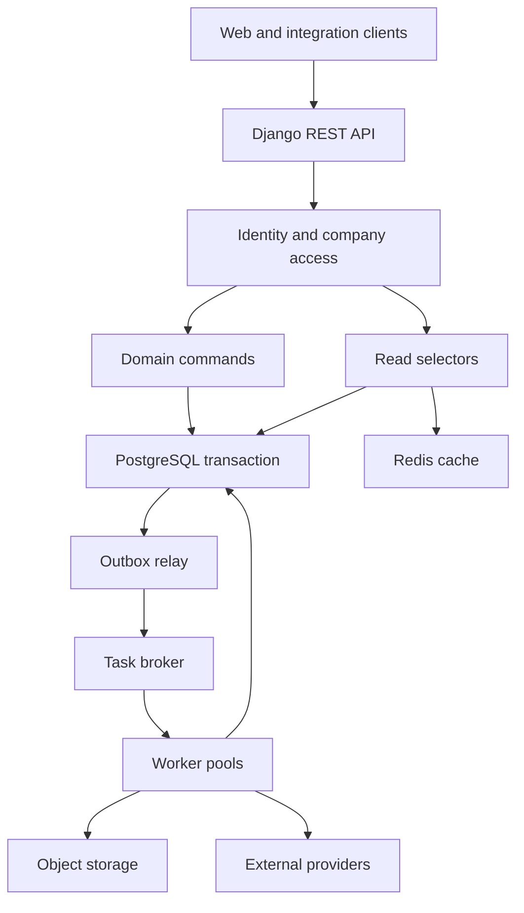

# ERP backend architecture and API design

**Stack:** Django, Django REST Framework, PostgreSQL, PgBouncer, Celery, and Redis.  
**Deployment versions:** managed cloud and self-managed VPS, both online.  
**Design date:** 26 September 2026.  
**Business domains:** wholesale, retail, e-commerce, and manufacturing.

**Reading map:** sections 3–4 cover Django structure and tenant access; section 5 covers company module administration; sections 6–8 cover transactions, licensing, and schema additions; sections 9–10 define APIs; sections 11–14 cover jobs, latency, migrations, and verification.

## 1. Scope and how to use this design

This document defines the shared application architecture, company module controls, API contracts, transaction rules, and implementation prerequisites. Read it alongside the two deployment documents:

- [Managed cloud architecture](sandbox:/workspace/scratch/082cfa469e03/erp-backend-managed-cloud.md)
- [Self-managed VPS architecture](sandbox:/workspace/scratch/082cfa469e03/erp-backend-vps.md)

The executable storage package is [erp-accounting-backend-schema.sql](sandbox:/workspace/scratch/082cfa469e03/erp-accounting-backend-schema.sql). For an existing installation, use [erp-accounting-backend-upgrade.sql](sandbox:/workspace/scratch/082cfa469e03/erp-accounting-backend-upgrade.sql) and follow [the SQL installation notes](sandbox:/workspace/scratch/082cfa469e03/erp-accounting-backend-schema-README.md). The original normalized baseline remains [erp-accounting-schema.sql](sandbox:/workspace/scratch/082cfa469e03/erp-accounting-schema.sql), with its companion [database architecture](sandbox:/workspace/scratch/082cfa469e03/erp-accounting-architecture.md). The baseline contains 71 tables and 9 views; the executable backend package extends it with identity, module, job, integration, inventory projection, tax-revision, and security objects.

**Status:** this is an implementation blueprint. The APIs and Django services described below have not been implemented or benchmarked. Proposed additions are explicitly identified; they are not already present in the baseline SQL. The baseline received structural checks in the earlier work, but has not been installed and exercised against a running PostgreSQL instance in this environment.

### 1.1 Primary decisions

| Decision | Design |
|---|---|
| Application shape | One modular Django application, independently deployed as API, worker, and scheduler processes |
| Transaction boundary | A business posting and its source document, GL, inventory effects, allocations, audit, and outbox commit together |
| Tenant boundary | A tenant owns companies; all requests authorize tenant membership and company membership |
| Module boundary | Company module configuration is evaluated together with license entitlement and user permission |
| Storage | PostgreSQL is authoritative for accounting, access policy, job state, and durable integration events |
| Cache | Redis accelerates replaceable reads; financial correctness never depends on a cached balance |
| Messaging | Celery executes durable work represented by PostgreSQL jobs/outbox records; consumers tolerate duplicates |
| Deployment portability | The same application image, migrations, and API contracts run on cloud or VPS |
| Scale | Scale API and worker processes first; tune PostgreSQL and reporting separately; shard by tenant only after measurement |
| Latency | Set measured endpoint budgets, bound database concurrency, and remove synchronous network calls from posting |

“Lowest latency” depends on customer-to-region RTT, transaction size, storage, locks, and load. The budgets in this package are engineering targets, not measured guarantees. Keep database durability enabled.

## 2. Technology baseline and execution model

| Component | Baseline | Role |
|---|---|---|
| Python | A supported Python release compatible with the pinned dependencies; Python 3.13 is a suitable starting candidate | Runtime |
| Django | Django 5.2 LTS, on its latest supported security patch | Application framework and migrations |
| API | A pinned DRF release tested with Django 5.2 | Serializers, views, authentication integration, pagination |
| PostgreSQL | PostgreSQL 18, matching the existing `uuidv7()` DDL | Transactional database |
| Driver | psycopg 3 | PostgreSQL access |
| Web process | Gunicorn with synchronous Django/DRF handlers; bounded process/thread counts | HTTP application execution |
| Pooler | PgBouncer in transaction mode | Bound server connections across replicas |
| Worker | A maintained Celery release, pinned and tested | Exports, imports, connector delivery, tax submission |
| Cache | Dedicated Redis instance/service | Replaceable application cache and optional session acceleration |
| Broker | Separate Redis instance/service configured for queue use | Celery transport |
| Files | Object storage | Attachments, generated PDFs, exports, backups |
| Observability | Structured logs, metrics, distributed traces, PostgreSQL query statistics | Diagnose latency and failures |

Django lists 5.2 as an LTS series with extended support through April 2028 [D1]. Pin exact compatible package versions in a lockfile; verify the matrix in CI before upgrades.

Use synchronous transaction services for financial commands. Django 5.2 documents limitations for transactions in async code [D2]. ASGI can be introduced for a specific long-lived I/O feature, but changing the server interface alone does not accelerate database posting. Large exports and imports run as jobs.

### 2.1 Shared component topology



The API does not call another internal microservice to create each journal line or tax component. Domain modules collaborate in the same process and transaction. External provider calls occur after durable intent is committed.

## 3. Django project structure and module ownership

### 3.1 Suggested repository layout

| Path | Responsibility |
|---|---|
| `config/settings/base.py` | Shared Django configuration |
| `config/settings/cloud.py` | Managed service endpoints and cloud settings |
| `config/settings/vps.py` | VPS service endpoints and resource settings |
| `config/urls.py` | Versioned URL namespaces |
| `config/wsgi.py`, `config/celery.py` | Web and worker entry points |
| `apps/identity/` | Custom UUID user model, login, memberships, company roles |
| `apps/tenancy/` | Tenants, companies, request scope, provisioning |
| `apps/module_access/` | Module catalog, dependencies, company policy, capability response |
| `apps/licensing/` | Existing license tables, entitlement resolver, renewal commands |
| `apps/accounting/` | Accounts, journals, periods, posting, reversal |
| `apps/parties/` | Partners, addresses, partner tax registrations |
| `apps/sales/` | Sales orders, invoice drafts, posting orchestration |
| `apps/purchasing/` | Purchase orders and supplier bills |
| `apps/payments/` | Receipts, disbursements, allocations, withholding settlement |
| `apps/inventory/` | Items, locations, stock commands, reservations, costing |
| `apps/manufacturing/` | BOMs, production orders, material issues, output |
| `apps/taxation/` | Jurisdiction catalogs, deterministic tax engine, filings, assessments |
| `apps/taxation/adapters/` | Versioned country/jurisdiction calculation and filing adapters |
| `apps/integrations/` | Connections, authenticated webhook intake, inbox, outbox relay |
| `apps/reporting/` | Report selectors, summaries, snapshot/export jobs |
| `apps/audit/` | Append-only business and administration audit events |
| `apps/jobs/` | Durable job records, leases, retry/recovery orchestration |
| `common/api/` | Error format, pagination, scoped API bases, idempotency |
| `common/db/` | Tenant transaction context, lock helpers, SQL functions |
| `tests/contracts/`, `tests/concurrency/`, `tests/load/` | API contracts, financial races, latency workloads |
| `deploy/cloud/`, `deploy/vps/` | Deployment configuration and runbooks |

Each domain app contains `models/`, `api/serializers.py`, `api/views.py`, `api/urls.py`, `services/`, `selectors/`, `tasks.py`, `migrations/`, and tests as needed.

- **Views** authenticate, parse input, dispatch a command or selector, and format a response.
- **Serializers** validate shape and simple field rules. Financial workflows live in services.
- **Services** enforce company permissions, module access, lifecycle, locking, calculations, and transaction rules. Workers call the same services.
- **Selectors** own explicit company-scoped read queries, prefetching, and response projections.
- **Models and database constraints** represent storage relationships and invariants.
- **Tasks** load a durable job/event and invoke a service. They do not invent a second posting implementation.

Do not put invoice posting in `Model.save()`, a Django signal, or an unrestricted `ModelViewSet.update()`. These entry points obscure transaction ordering and retries.

### 3.2 Mapping Django modules to existing tables

All names in this table already exist in the SQL.

| App | Existing storage |
|---|---|
| tenancy | `erp.tenants`, `erp.companies` |
| accounting | `erp.accounts`, `erp.journals`, `erp.fiscal_periods`, `erp.document_sequences`, `erp.accounting_posting_rules`, `erp.journal_entries`, `erp.journal_lines`, `erp.journal_line_dimensions`, `erp.dimension_types`, `erp.dimension_values` |
| parties | `erp.business_partners`, `erp.partner_addresses`, `erp.partner_tax_registrations` |
| sales | `erp.sales_channels`, `erp.sales_orders`, `erp.sales_order_lines`, `erp.sales_invoices`, `erp.sales_invoice_lines`, `erp.sales_invoice_address_snapshots`, `erp.sales_invoice_tax_components` |
| purchasing | `erp.purchase_orders`, `erp.purchase_order_lines`, `erp.purchase_bills`, `erp.purchase_bill_lines`, `erp.purchase_bill_address_snapshots`, `erp.purchase_bill_tax_components` |
| payments | `erp.payments`, `erp.ar_receipt_allocations`, `erp.ap_disbursement_allocations`, `erp.payment_tax_components` |
| inventory | `erp.items`, `erp.item_accounting_profiles`, `erp.warehouses`, `erp.inventory_lots`, `erp.stock_movements`, `erp.inventory_cost_allocations`, `erp.inventory_reservations`, `erp.uoms`, `erp.uom_categories` |
| manufacturing | `erp.boms`, `erp.bom_lines`, `erp.production_orders`, `erp.production_material_issues`, `erp.production_outputs` |
| taxation | `erp.tax_jurisdictions`, `erp.tax_types`, `erp.tax_rate_schedules`, `erp.tax_rate_versions`, `erp.company_tax_registrations`, `erp.tax_codes`, `erp.tax_code_components`, `erp.tax_filing_periods`, `erp.tax_returns`, `erp.tax_return_lines`, `erp.tax_assessments`, `erp.tax_assessment_lines` |
| integrations | `erp.integration_event_inbox`, `erp.outbox_events` |
| licensing | `licensing.products`, `licensing.plans`, `licensing.plan_versions`, `licensing.plan_features`, `licensing.licenses`, `licensing.license_terms`, `licensing.license_activations`, `licensing.license_events`, `licensing.signing_keys`, `licensing.signed_grants` |
| reporting | Existing `erp.v_*` views and `licensing.v_active_license_entitlements`, `licensing.v_active_license_features` |

### 3.3 Django adoption of the SQL schema

1. Establish a custom UUID user model before the first Django auth migration. The existing SQL has no application user, membership, or company role model.
2. Treat the current SQL as the database baseline. Convert it into reviewed, ordered migrations; do not run its enclosing `BEGIN`/`COMMIT` blindly inside an atomic Django migration.
3. For most tables, map the existing UUID `id` to the Django primary key. Preserve `company_id` and all company-safe composite foreign keys.
4. Schema-qualified table mapping must be integration-tested. An explicit mapping example is `db_table = '"erp"."sales_invoices"'`; avoid accidentally creating a table literally named `erp.sales_invoices` in `public`.
5. Preserve SQL-owned constraints, functions, views, and triggers using `RunSQL` and appropriate migration state. Use `SeparateDatabaseAndState` when database changes and model state differ.
6. Do not assume `inspectdb` reproduces every composite foreign key, policy, trigger, or database default.
7. Django 5.2 composite primary-key relationships and admin support have limitations [D3]. Use explicit SQL repositories for composite-key bridges and sequence tables, or deliberately add surrogate keys while retaining their business unique constraints. Avoid relying on private ORM APIs as the main integrity mechanism.
8. Preserve UUIDv7 generation by a tested database-default mapping or a vetted application UUIDv7 generator. A model default of UUIDv4 would override the intended database default.
9. Migrations run under a separate owner role. API and worker database roles are non-owners with no `BYPASSRLS`.
10. Tenant flags do not alter Django `INSTALLED_APPS`. All shipped app code and migrations are deployed consistently; company access is decided at runtime.

## 4. Identity, tenant isolation, and request execution

### 4.1 Authentication and company roles

For the first-party browser application, use Django session authentication over HTTPS with secure HttpOnly cookies and CSRF protection. The login flow must enforce CSRF as well. External integrations use scoped service credentials or short-lived OAuth/OIDC access tokens validated locally; implement key rotation and audience/issuer checks. A raw license number is never an API bearer credential.

Add these identity concepts through Django migrations:

| Proposed object | Key facts and constraints |
|---|---|
| `identity.users` | UUID identity; Django password/auth integration; active status |
| `identity.tenant_memberships` | Unique `(tenant_id, user_id)`; active status; tenant owner/admin capabilities |
| `identity.company_memberships` | User membership belongs to the same tenant as the company; unique `(company_id, user_id)` |
| `identity.roles` | Company-scoped named roles; unique `(company_id, code)` |
| `identity.role_permissions` | Permission-code associations |
| `identity.company_role_assignments` | Membership-to-role assignments with company-safe foreign keys |
| `identity.service_accounts` | Tenant/company scope, permitted actions, credential hash/reference, expiry/revocation |

Typical permissions are `sales.invoice.view`, `sales.invoice.edit_draft`, `sales.invoice.post`, `accounting.entry.reverse`, `company.modules.manage`, and `tax.return.submit`.

Django `is_staff` grants admission to Django admin; it is not the company authorization model. Default admin screens must never expose unrestricted cross-company querysets or direct editing of posted accounting data. Provide a scoped company administration UI/API backed by the same services.

### 4.2 Authorization order

For a company business operation, evaluate:

1. Authenticated identity and active account/service credential.
2. Tenant membership and company membership, or an explicitly authorized service role.
3. Company active status.
4. Applicable tenant/product license and its current term.
5. Licensed feature and quota.
6. Company module mode and dependency requirements.
7. User permission for the exact action.
8. Object company ownership, lifecycle, and financial invariants.

For historical reads, renewal, and emergency administration, apply the explicit read-only/renewal policy in section 7 instead of the normal business-write entitlement gate. Company isolation and user permission still apply.

DRF object permissions do not automatically filter every row in a list response; filter querysets and validate creation scope explicitly [D4]. Never fetch an invoice solely by `id` and authorize its company afterward.

### 4.3 RLS and transaction context

The baseline RLS policy is tenant-scoped. A user in one tenant can still belong to only selected companies, so company membership checks and `company_id` filtering are mandatory.

Use one tenant context per database transaction:

```sql
SELECT set_config('app.tenant_id', :authorized_or_candidate_tenant_uuid, true);
```

The third argument makes the setting transaction-local. The candidate tenant ID may come from the route, but membership must be established before loading or returning business data. Authentication identity resolution happens in the identity layer; any pre-tenant lookup is narrowly filtered by the authenticated user/service identity.

Implement a shared tenant transaction context with one clear owner of the outer transaction:

- Authenticate first. A query endpoint opens a short `transaction.atomic()` block around scoped reads; a command endpoint delegates to the service that owns its outer transaction.
- Set the tenant context and then resolve tenant/company membership.
- Perform all ERP permission checks and queries inside that context.
- Materialize serializer data into ordinary values before leaving the transaction. A lazy queryset must not run later under a different pooled connection context.
- Commit before sending a success response. Catch database failures outside the atomic block.
- In each worker transaction, set the context again and verify the job's company belongs to its tenant.

Do not wrap the command example in section 6.3 in another request-level atomic block: its `atomic(durable=True)` deliberately owns the outermost transaction. Keep `ATOMIC_REQUESTS=False`. Reusable internal helpers participate in the caller's transaction and do not independently commit.

Avoid setting tenant state with a session-level `SET`. Transaction pooling can reuse connections across requests. Streaming a lazy database response after the transaction ends also breaks this model; large exports use jobs [D5].

For applications needing database enforcement of company membership as well as tenant isolation, add a carefully tested company/user context and company policy. The supplied SQL does not already provide that extra layer. RLS is defense in depth; a role that owns tables or bypasses RLS defeats the expected boundary [D6].

Tenant discovery needs a separate narrow path: load the authenticated identity's membership references first, then resolve tenant labels through bounded authorized contexts or a reviewed lookup helper. The baseline tenant policy permits only the current tenant, so a normal unscoped ORM query cannot simply list every accessible tenant. Do not disable RLS for the discovery endpoint.

## 5. Company-level module enable/disable

### 5.1 What an effective module means

For a normal business write:

```text
effective_write_access =
    account_active
    AND company_membership_valid
    AND license_term_valid_at_command_acceptance
    AND licensed_feature_enabled
    AND company_module_mode_is_enabled
    AND required_dependencies_are_enabled
    AND action_permission_granted
    AND business_state_allows_command
```

A company setting cannot grant a feature the license does not include. A license feature does not grant user permission. UI visibility follows a capabilities API; every API and background command independently enforces the policy.

### 5.2 Module catalog and dependencies

| Module code | Required for | Dependency rules |
|---|---|---|
| `core` | Company setup, users, policy, audit/export access | Mandatory |
| `accounting` | Ledger, periods, core financial history | Mandatory for this ERP accounting product |
| `tax_calculation` | Tax determination and immutable component snapshots | Internal required capability for taxable sales/purchases/payments |
| `sales` | Orders and invoices | `accounting`, `tax_calculation` |
| `purchasing` | Supplier orders and bills | `accounting`, `tax_calculation` |
| `payments` | Receipts, disbursements, allocations | `accounting`; withholding also invokes `tax_calculation` |
| `inventory` | Stock, reservations, costing | `accounting` |
| `manufacturing` | BOM and production commands | `inventory`, `accounting` |
| `ecommerce` | Connector processing | `sales`; stocked fulfillment additionally requires `inventory` |
| `tax_filing` | Returns and assessments | `accounting`, `tax_calculation` |
| `advanced_reporting` | Optional dashboards and scheduled analysis | Appropriate source modules for new operational work; historical accounting remains available |
| `retail_pos` | Cash drawers, tenders, POS sessions | Future extension: the existing schema has retail channels but no full POS session/tender model |

Dependencies form an acyclic catalog defined by the software release. Enabling manufacturing requires writable inventory. Switching inventory to read-only while manufacturing remains enabled fails validation; the administrator can change both in one request.

Authorize every intended side effect, not just the route's leading module name. An invoice command that also consumes stock requires the licensed, enabled inventory capability and the permitted fulfillment action. A service-only invoice can remain eligible without inventory. Ecommerce commands similarly check the sales/inventory actions they invoke.

Example company configurations under a license that permits all these features:

| Company | Sales | Inventory | Manufacturing | Ecommerce |
|---|---|---|---|---|
| Wholesale distributor | Enabled | Enabled | Disabled | Disabled |
| Factory | Enabled | Enabled | Enabled | Disabled |
| Online retailer | Enabled | Enabled | Disabled | Enabled |

These are independent company settings; changing the factory's manufacturing mode does not change another company's configuration.

### 5.3 Modes and historical data

| Mode | Module UI | Module reads | Business writes |
|---|---|---|---|
| `enabled` | Visible | Allowed with permission | Allowed with entitlement and permission |
| `read_only` | Visible with read-only indicator | Allowed with permission | Rejected |
| `disabled` | Hidden from ordinary navigation | Ordinary module endpoints rejected | Rejected |

Disabling never deletes data, drops tables, or reverses accounting. Historical financial records remain available through authorized accounting, audit, and export routes. Payment settlement of an existing receivable can continue when `payments` and `accounting` are enabled, even if new sales activity has been disabled. Internal reading of a historic source record is distinct from permission to create a new source transaction.

### 5.4 Required schema additions for module controls

These objects are **proposed additions** to the existing SQL.

| Table | Columns and relationships | Integrity and indexes |
|---|---|---|
| `erp.module_definitions` | `code`, `name`, `license_feature_code`, `is_required`, `release_status` | Global catalog; PK `code`; controlled by platform release/admin only |
| `erp.module_dependencies` | `module_code`, `required_module_code` | Composite PK; both FKs to definitions; reject self-reference and cycles in catalog publication |
| `erp.company_policy_state` | `company_id`, `revision`, `updated_at` | PK/FK company; one row created with company; revision increases on access-policy changes |
| `erp.company_module_settings` | `company_id`, `module_code`, `mode`, `changed_by`, `changed_at` | PK `(company_id, module_code)`; company and module FKs; mode check; company RLS |
| `erp.company_audit_events` | UUID `id`, company, actor, action, object reference, old/new policy snapshots, reason, request ID, occurrence time | Append-only; `(company_id, occurred_at, id)` index; company RLS |

`changed_by` references the new custom user model. Use a separate verified service identity for automated changes. Financial module settings belong in typed domain tables; do not store tax rates, stock policies, and account IDs in an unrestricted module-flags JSON object.

Missing optional module rows default to disabled. Mandatory module rows are provisioned and protected against ordinary disable operations. Provisioning is idempotent and transactional.

### 5.5 Concurrent administration and posting

Use a durable company policy row, not Redis alone, to coordinate changes:

1. A protected business command takes `FOR SHARE` on `erp.company_policy_state` and reads the relevant settings in the same transaction. Multiple commands can share this lock.
2. A module-change request takes `FOR UPDATE` on that policy row. It waits for already-authorized commands to finish.
3. Re-check the `If-Match` policy revision, license eligibility, admin permission, and all affected dependencies.
4. Apply the entire change set, increment the revision, append audit records, and write a policy-change outbox event in one transaction.
5. After commit, invalidate caches. New commands read the new revision before authorization.

This defines a clear boundary: previously accepted commands may finish before the disable transaction commits; new commands after that commit must see the new mode. The parent policy row avoids absent-child-row races when a module setting is first created. PostgreSQL shared/exclusive row-lock behavior supports this pattern [D7].

Cache feature snapshots by `(tenant_id, company_id, company_policy_revision, entitlement_revision)`. The primary database supplies the authoritative revision for protected operations. A UI-only capabilities cache may tolerate a documented short delay; the write gate cannot use that stale UI cache.

Company membership, role-grant, and company-active-state changes must also acquire the exclusive company policy lock and increase the relevant authorization revision. Commands revalidate company membership and action permission after acquiring the shared policy lock. Tenant/global identity revocation is checked at command acceptance; already accepted bounded transactions can finish under the documented revocation policy.

### 5.6 Module administration API

All paths here use the company prefix defined in section 9.

| Method and path | Purpose |
|---|---|
| `GET /capabilities` | Effective modules/actions, denial reasons, quota information, and policy revision for UI |
| `GET /admin/modules` | Configured modes, effective license eligibility, dependencies, and current revision |
| `POST /admin/module-changes/validate` | Validate a proposed batch and return blockers; no changes |
| `POST /admin/module-changes` | Atomically enable, disable, or set read-only mode for modules |
| `GET /admin/module-events` | Authorized audit history |

A mutating request requires `company.modules.manage`, an idempotency key, and `If-Match`. Example:

```http
POST /api/v1/tenants/{tenant_id}/companies/{company_id}/admin/module-changes
Idempotency-Key: 61b3630b-70a4-4eca-87bd-c3111fa7d105
If-Match: "policy-42"
Content-Type: application/json
```

```json
{
  "changes": [
    {"module_code": "manufacturing", "mode": "read_only"},
    {"module_code": "inventory", "mode": "read_only"}
  ],
  "reason": "Suspend new production and inventory operations at this company"
}
```

```json
{
  "company_id": "01995bb0-1111-7000-8000-000000000001",
  "policy_revision": 43,
  "changes": [
    {"module_code": "manufacturing", "mode": "read_only"},
    {"module_code": "inventory", "mode": "read_only"}
  ],
  "audit_event_id": "01995bb0-2222-7000-8000-000000000002"
}
```

A missing precondition is `428`; an outdated revision is `412`. Dependency or business-state conflicts use `409`. Missing permission or entitlement uses `403`. A failed change set leaves all module modes unchanged.

## 6. Application and database transaction rules

### 6.1 Required posting lock correction in the baseline

Both `erp.post_journal_entry()` and `erp.guard_posted_journal_entry()` currently acquire `FOR UPDATE` on `erp.fiscal_periods`. This serializes postings to the same period even when invoices are unrelated.

Before implementing the latency targets:

- Change the period-read lock in **both** functions to `FOR SHARE`.
- Period close/lock/reopen commands acquire `FOR UPDATE` on that period row.
- Posting checks that the period remains open while holding the shared lock.
- Use a common lock order in posting, reversal, period close, and administration services.
- Verify concurrent posters proceed and that period close waits for active postings; test the opposite race as well.

`FOR KEY SHARE` is insufficient here: it can allow an update to a non-key status column. `FOR SHARE` prevents such updates while allowing other posters to hold shared locks [D7]. This is a required migration recommendation; this document does not alter the baseline SQL.

### 6.2 Lock ordering

Use this order when a command touches the corresponding objects:

1. Its idempotency record.
2. Tenant/product entitlement coordinator/binding row and then selected license row, shared for business writes.
3. Company policy row, shared for business writes.
4. Fiscal periods, sorted by company and ID; shared for posting.
5. Source documents, payments, and allocation targets, sorted by type and ID.
6. Stock scopes/cost layers, sorted by warehouse, item, lot, and ID.
7. Number-sequence rows and the command's journal aggregate.

Some commands omit most of these locks. Re-check pre-read document versions after acquiring locks. Avoid attempting a shared-to-exclusive policy lock upgrade from a business command. Administrative mutations use their own lock order and do not wait for downstream business-record locks while holding an exclusive policy lock.

Deadlocks and serialization failures remain possible. Roll back the entire command, then retry a bounded number of times with jitter and the same idempotency key. A network timeout after commit has an uncertain outcome; the client repeats the same key to discover the committed result.

### 6.3 Invoice posting transaction

1. Validate request shape and calculate its canonical request hash.
2. Begin one database transaction, bind tenant context, and authorize company membership.
3. Claim/replay the idempotency key; replays require current permission to view the original result.
4. Validate and lock license and company policy, then the selected fiscal period.
5. Lock the draft invoice and check its revision. If its relevant date/period changed since a pre-read, abort and require a fresh revision.
6. Validate partner, registrations, account mappings, currency, and country tax rules. Resolve tax calculations locally from versioned configuration.
7. Write final line, address, and per-component tax snapshots while the invoice is draft.
8. If the operation includes a stock event, lock and write the inventory/cost effects in this transaction. Decide explicitly whether the business posts stock at shipment or at sale; do not reduce it at both events.
9. Allocate numbers, create journal header/lines/dimensions, and verify the source-to-ledger mapping.
10. Call `erp.post_journal_entry(company_id, journal_entry_id)` after the lock migration above. Update the invoice to posted with its journal reference.
11. Insert audit and `erp.outbox_events` rows and complete the idempotency result in the same transaction.
12. Commit; only then return success. PDFs, notifications, and provider updates run afterward.

The journal-balance trigger checks double-entry balance. It does not prove that the correct tax account, invoice total, or inventory cost was posted; those mappings require domain validation and financial tests.

**Service-boundary sketch, not complete runnable application code:**

```python
def post_invoice(actor, scope, invoice_id, command, idempotency_key):
    with transaction.atomic(durable=True):
        set_tenant_context(scope.tenant_id)
        authorize_company_membership(actor, scope)
        receipt = claim_or_replay_command(
            scope, actor, operation="sales.invoice.post", resource_id=invoice_id,
            key=idempotency_key, command=command,
        )
        if receipt.is_replay:
            return authorize_and_load_previous_result(actor, scope, receipt)

        entitlement = lock_and_check_entitlement(scope, feature="module.sales")
        policy = lock_and_check_company_policy(scope, module="sales", mode="write")
        authorize_company_membership(actor, scope)
        validate_entitlement_at_acceptance(entitlement, database_clock())
        require_permission(actor, scope, "sales.invoice.post")
        lock_open_period_shared(scope, command.fiscal_period_id)
        invoice = lock_draft_invoice(scope, invoice_id, command.expected_revision)
        snapshots = calculate_and_validate_local_tax(invoice, scope)
        apply_document_and_inventory_effects(invoice, snapshots, scope)
        entry = build_and_post_balanced_journal(invoice, scope)
        mark_invoice_posted(invoice, entry)
        append_audit_and_outbox(scope, invoice, entry)
        result = materialize_posting_result(invoice, entry)
        complete_command_receipt(receipt, result)
    return result
```

The called helpers are services to implement. Database errors must escape the transaction before conversion to an API error. All success responses are constructed from committed business identifiers; they do not expose a lazy ORM object.

The baseline requires document numbers even while a record is draft (`invoice_no`, `bill_no`, `payment_no`, `entry_number`). Until a dedicated draft-reference migration is adopted, use unique clearly provisional draft references, then replace them with the final sequence number while still draft in the posting transaction. Do not consume a final legal number at every abandoned draft. Never publish the provisional reference as the issued document number.

### 6.4 Payments and allocation correctness

The existing allocation tables record document-currency and payment-currency amounts. The payment `amount` is cash; `withholding_total` is separate. A withholding settlement commonly consumes cash plus withholding against a liability or receivable; the precise journal mapping follows the direction and tax treatment.

The payment service must lock the payment and all target documents in deterministic order, then enforce:

- Correct company, partner, direction, posted source status, and currency conversion.
- Remaining document amount and remaining payment settlement capacity under the same locks.
- No duplicate allocation or over-allocation under concurrent requests.
- Withholding component totals, tax accounts, and applicable receivable/payable entries.
- Immutable posted allocations; adjustments use explicit compensating records and journals.

The baseline AR/AP views clamp negative open amounts to zero and do not themselves prevent over-allocation. They also do not constitute a complete credit-note application subsystem. Add allocation mutation guards and explicit credit/adjustment application records before exposing these operations broadly.

### 6.5 Inventory and manufacturing

The append-only stock ledger is the source of quantity/value history. An aggregate `SUM()` query alone does not reserve stock safely: concurrent callers can both observe the same quantity.

Add a company/warehouse/item/lot stock-scope row to lock, or a carefully maintained `erp.inventory_positions` projection with the same scope. If using the projection for low-latency availability, update it, reservations, cost-layer consumption, and stock movements in the same service transaction. Use uniqueness that treats a null lot as one scope, and reconcile/rebuild the projection from the ledgers. This is a proposed addition, not an existing table.

Manufacturing material issue and completion lock the production order, relevant stock scopes, and cost layers. Update material/output records and WIP/finished-goods accounting atomically. `completed_quantity` must be checked against all prior output records under the order lock. The existing lifecycle is `planned`, `released`, `in_progress`, `completed`, `cancelled`.

### 6.6 Tax engine and filings

The taxation app supports the existing split among sales/purchase tax components, payment withholding, tax returns, and period assessments. A versioned jurisdiction adapter receives registrations, partner classification, place of supply, tax point, item classification, currency, and amounts. It returns component bases, rates, recoverability, rounding, and account roles.

Keep tax calculation deterministic and local during posting. Any government lookup or remote tax-provider request that is required must be resolved in a preparatory workflow; the posting transaction validates the resulting versioned evidence. Retain the effective rule and calculation outcome with the document.

The current tax detail view needs currency and credit-note polarity fields before it can safely feed multi-currency or credit-adjusted statutory totals. Filed returns require immutable revision snapshots and submission-attempt records. The baseline unique return key permits one return kind per period, so amendments need a revision migration. Tax assessments also need a validated posted-journal link and reconciliation of workpaper totals before the assessment posting API is enabled.

## 7. License validity and entitlement enforcement

Reuse the existing `licensing` schema. Keep it in the same PostgreSQL database initially, with separate access roles and administrative API permissions. It currently has foreign keys to ERP tenants and currencies; moving it into a different physical database requires a deliberate migration and entitlement projection, not just a new Django database router.

### 7.1 License selection, periods, and features

- Add a tenant/product license binding so the resolver selects one designated license. The existing active-entitlement views may return multiple licenses for the same tenant/product; do not choose one arbitrarily or sum limits without a commercial rule.
- A monthly purchase adds a non-overlapping `licensing.license_terms` row. Compute one calendar month using a documented billing timezone/anchor rule, then store UTC boundaries.
- Example boundary policy: a January 31 monthly anchor ends February 28 in a non-leap year; subsequent terms preserve the contractual month-end anchor. Do not silently replace one month with 30 days.
- Lifetime access has `expires_at IS NULL`. Suspension/revocation still applies. Support and update validity remain independent fields.
- The command must start within the valid interval. Define completion semantics: an accepted transaction may finish within the bounded transaction timeout after its start; a new command after expiry is denied.
- License feature codes map to module definitions, for example `module.manufacturing`; numeric limits use codes such as `limit.companies` and `limit.users`.
- Device activation limits are distinct from named-user seats and enabled-company limits. Each quota needs its own counted resource and concurrent allocation control.

### 7.2 Monthly renewal and lifetime issue workflow

1. Create a software-license billing order with an idempotency key.
2. Process a verified payment-provider event and record its unique provider/event reference.
3. Lock the license and quota/billing state, check the published purchased plan version, and calculate the next term boundaries.
4. Append the term and license audit event once; mark the billing order fulfilled in the same transaction.
5. Publish an entitlement-change event and invalidate the entitlement cache after commit.

The existing `erp.payments` table belongs to the customer's business accounting. Add separate licensing billing/order/event records for collecting your software subscription payments. Public company APIs cannot submit arbitrary `expires_at`, `plan_version_id`, or lifetime entitlements as trusted authority.

The baseline non-overlap trigger supports sequential renewals. An immediate mid-term upgrade needs an explicit entitlement-adjustment/amendment model; otherwise schedule the upgrade to start at the current term's end.

### 7.3 Expiry, revocation, and caching

Resolve active entitlement on the primary database for protected writes; immutable plan-feature data may be cached by plan version. Keep license status stable during a write using a shared lock on the selected license/entitlement row. Suspension/revocation takes the corresponding exclusive lock, with the same global lock order as company policy changes.

Provision one entitlement coordinator/binding row per tenant/product. Lock it before the selected license; binding changes, renewals, suspension, and revocation follow that same order and increment `entitlement_revision`. Resolve validity against the authoritative command-acceptance timestamp after acquiring the necessary policy locks, rather than a stale timestamp captured before a long lock wait.

The existing active-entitlement views use `statement_timestamp()`. When applying the acceptance boundary above, compare the selected term against a freshly captured database `clock_timestamp()` after lock acquisition, with `starts_at <= accepted_at` and `expires_at IS NULL OR accepted_at < expires_at`. A view result or statement-start timestamp captured before a lock wait must not be the only expiry check.

Grant the runtime only the database privileges needed for this protocol. Locking a row can require update privileges even when its values are not changed. If ordinary ERP writers must not update license data, expose a narrow reviewed database lock/resolve function with a fixed safe search path, explicit tenant/product checks, restricted execution grants, and a suitably limited owner; do not grant broad license mutation rights just to obtain a lock.

After expiry, allow authenticated renewal access and authorized historical accounting/audit/export reads according to the product policy. Reject new business writes with a stable `LICENSE_EXPIRED` error. Never delete company data as an expiry side effect.

If licensing is later moved to a separate control-plane database, maintain a signed, versioned local entitlement projection and explicitly choose the maximum revocation propagation delay. Do not call a remote license server on every invoice post. Instant cross-database revocation and disconnected cached authorization cannot both be assumed.

### 7.4 Required baseline licensing hardening

Before exposing license APIs, migrate these details:

- Require `term_count IS NOT NULL` for non-lifetime plan versions and require both non-null expiry and non-null count for non-lifetime terms. PostgreSQL `CHECK` expressions that evaluate to null can otherwise pass.
- Only issue terms against a published plan version; validate that its product matches the bound license.
- Allow deactivation and operational cleanup after expiry/suspension. The existing activation guard currently requires active access even for every update.
- Separate harmless heartbeat updates from activation/reactivation quota checks. The current guard takes an exclusive parent-license lock on every update; retaining that behavior for frequent heartbeats would unnecessarily block concurrent licensed commands. Preserve immutable device/binding checks and exclusive coordination for actual quota changes.
- Validate grant expiry against the term and signing key; permit only the signing service to issue grants.
- Establish tenant/product binding uniqueness and quota rules, and preserve append-only history.

Generate license credentials using a cryptographically secure random source, show the full value only through an authorized delivery flow, and store a one-way digest with a documented normalization scheme. Use only the existing last-four field for ordinary display; redact full values from logs and audits.

Both deployment versions in this package are online. The existing signed-grant support remains available for future product requirements but does not replace server-side user/company authorization.

## 8. Required supporting persistence

| Proposed addition | Minimum data and integrity |
|---|---|
| `erp.api_command_receipts` | Required tenant, optional company, principal, normalized operation, key, canonical request hash, result reference, response status, timestamps; unique scoped key with null company treated as one tenant-level scope; tenant RLS and tenant/company composite FK |
| `erp.background_jobs` | Required tenant, optional company, requester, job type, immutable request parameters, status, progress, lease token/expiry, attempts, result object key, safe error, timestamps; tenant RLS and tenant/company composite FK |
| `erp.company_audit_events` | Append-only record of privileged and financial actions; no secrets in payloads |
| `erp.integration_connections` | Company, channel, provider, public routing ID, secret-manager reference, enabled mode, integration permissions |
| `erp.inventory_documents` and lines | Typed receiving/transfer/adjustment headers and source references for operational commands |
| `erp.inventory_positions` | Optional synchronized stock projection/lock scope, required when full-history availability aggregation exceeds the operational budget |
| `licensing.tenant_product_bindings` | One coordinator/designated license per tenant/product; `entitlement_revision`; tenant-safe relationships to license/product |
| `licensing.billing_orders` and `licensing.billing_events` | Software purchase/renewal intent and verified provider receipts with uniqueness |
| Mutable document concurrency columns | Integer `row_version` or equivalent for drafts, BOMs, production orders, and settings; retain the existing BOM text `revision` as its business revision, not its optimistic-lock counter |
| Tax return revisions/submission attempts | Immutable filed versions, retries, government receipt correlation |
| Posted allocation guards/adjustment records | Safe AR/AP settlement, credits, refunds, and compensations |

Provision company policy and module rows in the same transaction as the company. Add company RLS and indexes to every new company-scoped table. Extend the RLS migration list deliberately; creating an additional business table must not silently omit isolation.

Tenant-level licensing commands/jobs use a null company scope and explicit tenant permissions; company commands require a non-null authorized company. Global catalog publication needs a separate private operator receipt/audit store (proposed `platform.operator_command_receipts`), because no customer company owns a global plan or tax pack. The `platform` schema is an addition, not part of the baseline. Use `UNIQUE NULLS NOT DISTINCT` or an equivalent tested uniqueness design for optional company scopes.

## 9. API-wide contracts

### 9.1 Namespaces

| Namespace | Scope |
|---|---|
| `/api/v1/auth/` | Login/session, current identity, credential lifecycle |
| `/api/v1/tenants/{tenant_id}/` | Tenant membership, company discovery, license summary |
| `/api/v1/tenants/{tenant_id}/companies/{company_id}/` | Company operational API; abbreviated **C** below |
| `/webhooks/v1/{provider}/{connection_public_id}/` | Provider-authenticated incoming events |
| `/platform-api/v1/` | Private platform operations, catalog publication, license issue/revoke |
| `/health/live`, `/health/ready` | Infrastructure probes with minimal public detail |
| `/metrics` | Private monitoring endpoint |

Do not infer authorization from a supplied tenant/company header. Route IDs select a scope that must be authorized. All API responses carrying business data are private; no shared CDN cache is used for them.

### 9.2 Request and response conventions

| Concern | Contract |
|---|---|
| Format | JSON; UTF-8; published OpenAPI contract generated from implemented serializers |
| IDs | UUID strings; never use sequential public IDs as an authorization mechanism |
| Money/quantity | Decimal strings matching schema precision; no binary float computations |
| Time | RFC 3339 UTC timestamps; explicit local business dates and IANA company timezone |
| Posting | Dedicated command endpoints; clients cannot `PATCH status=posted` |
| Draft changes | `If-Match` ETag based on integer revision; reject stale writes with `412` |
| Retry safety | `Idempotency-Key` required on posting, payment, stock, production, module change, renewal, and job commands |
| Lists | Default 50 rows, maximum 200; supported filters/sorts explicitly allowlisted |
| Pagination | Cursor/keyset ordering with a stable unique tiebreaker; e.g. `(entry_date, id)` |
| Expansions | Limited named expansions; no arbitrary nested serializer traversal |
| Counts | Optional exact count or separate count route; avoid full-table count on every page |
| Long operations | `202 Accepted` plus durable job URL; no open HTTP request for a large report |
| Error shape | Machine code, safe message, field details, request ID; no raw SQL/tracebacks |
| Audit | Correlation ID, actor, tenant/company, command, outcome, source IDs |

A keyset cursor encodes the last sort values and a filter fingerprint. It does not encode authorization. Every page re-evaluates tenant/company access. DRF offers cursor pagination, but the chosen ordering and query/index design remain application responsibilities [D8].

Example error:

```json
{
  "error": {
    "code": "MODULE_DEPENDENCY_CONFLICT",
    "message": "Manufacturing must also be changed before inventory can become read-only.",
    "details": {"dependent_modules": ["manufacturing"]},
    "request_id": "01995bb0-3333-7000-8000-000000000003"
  }
}
```

| Status | Typical use |
|---|---|
| `200`, `201` | Successful query/command; `201` for a newly created resource |
| `202` | Durable asynchronous job accepted |
| `400` | Invalid input, unsupported field/filter, malformed key |
| `401` | Missing/invalid authentication where the authentication scheme uses 401 |
| `403` | Permission, license, module, or CSRF denial; Django session authentication can also produce 403 for unauthenticated access |
| `404` | No accessible object in the authorized scope |
| `409` | Invalid lifecycle, dependency conflict, reused key with a different payload, insufficient stock |
| `412`, `428` | Revision mismatch; required concurrency precondition missing |
| `429` | Rate/concurrency limit, with retry guidance |
| `503` | Retryable service/database unavailability; repeat mutation with the same idempotency key |

### 9.3 Idempotency protocol

Scope the receipt by tenant/company, authenticated principal or integration identity, normalized operation/resource, and key. Store a canonical payload hash. Exclude transport-only headers from the hash but include all business inputs and relevant preconditions.

For synchronous commands, insert/claim the receipt and commit its successful outcome in the same transaction as the business effects. A competing insert on the unique key waits or receives the existing result after commit. The same key plus a different request hash returns `409`; it must never create a second transaction.

For asynchronous commands, persist the job, receipt, and outbox intent together. Replays return the same job. A lost response after commit is resolved through replay or the job/operation endpoint. Retention of the API receipt does not remove durable source/event uniqueness. The existing `erp.journal_entries.idempotency_key` only deduplicates its ledger scope; it is not a complete API idempotency store.

Replaying a completed result requires current authorization to read that result. It does not re-run business effects. Treat an already completed command as an operation receipt even when a later module change blocks new commands.

## 10. Proposed API catalog

**All routes in this section are contracts to implement.** `B` means the principal business tables exist in the baseline; it does not mean the endpoint exists or that no hardening migration is needed. `E` means additional persistence is required before enabling the operation. Unless a full prefix is shown, paths are relative to **C**, the authorized company prefix in section 9. Paths omit a trailing slash consistently; choose that policy in Django routing and OpenAPI.

All writes require the relevant action permission. Draft updates require an expected revision; state-changing commands also require an idempotency key. A module marked read-only permits its authorized query routes, while disabled modules follow section 5.3. Configuration writes that affect posting must participate in the corresponding policy/version protocol.

### 10.1 Identity, companies, and administration

| Method and path | Contract | Gate / persistence |
|---|---|---|
| `GET /api/v1/auth/csrf` | Bootstrap a CSRF token/cookie for the first-party session client where needed | Identity, E; no business data |
| `POST /api/v1/auth/session` | Authenticate; establish secure session; validate CSRF | Identity, E |
| `DELETE /api/v1/auth/session` | End current session | Identity, E |
| `GET /api/v1/auth/me` | Current identity and permitted tenant references | Identity, E |
| `GET /api/v1/tenants` | List the caller's tenants only | Tenant membership, E |
| `GET /api/v1/tenants/{tenant_id}/companies` | List accessible companies | Membership + B |
| `POST /api/v1/tenants/{tenant_id}/companies` | Provision company, policy defaults, roles, and required accounting setup atomically | Tenant admin + licensed company quota, E |
| `GET, PATCH /settings` | Read/update typed company settings | `company.settings.manage` on write; B + revision extension |
| `GET, POST /admin/memberships` | List/invite or assign eligible users to company | Company admin, E; invitation delivery is a job |
| `PATCH /admin/memberships/{id}` | Change membership status | Company admin, E; prevent removal of the last authorized administrator |
| `GET, POST /admin/roles` | List/create company roles | Company admin, E |
| `PATCH /admin/roles/{id}` | Update role permissions through a controlled grant policy | Company admin, E; no self-escalation beyond grant authority |
| `GET /capabilities` | Effective access and reasons | E; never contains credentials |
| `GET /admin/modules` | Company module settings and dependencies | `company.modules.manage`, E |
| `POST /admin/module-changes/validate` | Validate a batch without applying it | `company.modules.manage`, E |
| `POST /admin/module-changes` | Apply a revision-checked batch with audit | `company.modules.manage`, E |
| `GET /admin/module-events` | Company module change history | Admin audit permission, E |

Tenant onboarding is a privileged workflow; it must not create a new paying license merely because an unauthenticated caller supplied a company name.

### 10.2 Master data and partners

| Method and path | Contract | Gate / persistence |
|---|---|---|
| `GET /reference/currencies` | Supported currencies and precision | Core, B |
| `GET /reference/uoms` | Units and categories | Core, B |
| `GET, POST /partners` | Search/create customer or supplier | Party view/manage permission, B |
| `GET, PATCH /partners/{id}` | Partner details and versioned updates | Party permission, B + revision |
| `GET, POST /partners/{id}/addresses` | Address records within this partner/company | Party permission, B |
| `PATCH /partners/{id}/addresses/{address_id}` | Update current address; posted snapshots remain unchanged | Party permission, B |
| `GET, POST /partners/{id}/tax-registrations` | Registration facts and validity | Tax configuration permission, B |
| `GET, POST /sales/channels` | Wholesale, retail, ecommerce channel setup | Sales admin, B |
| `GET, POST /inventory/items` | Search/create items | Item permission; inventory or authorized sales/purchasing master-data capability, B |
| `GET, PATCH /inventory/items/{id}` | Item details and permitted updates | Item permission, B + revision |
| `GET, PUT /inventory/items/{id}/accounting-profile` | Posting account mapping | Accounting setup permission, B |

Items can represent non-stock services even when inventory is disabled. Model shared master-data permission separately from stock movement permission. Disabling inventory must not accidentally prevent a permitted service invoice from selecting an existing service item.

### 10.3 Accounting and periods

| Method and path | Contract | Gate / persistence |
|---|---|---|
| `GET, POST /accounting/accounts` | Chart of accounts | Accounting; setup permission for creation, B |
| `GET, PATCH /accounting/accounts/{id}` | Inspect/edit allowed account attributes | Accounting setup, B; protect historical account meaning |
| `GET, POST /accounting/journals` | Journal setup | Accounting setup, B |
| `GET, POST /accounting/dimension-types` | Dimension catalog | Accounting setup, B |
| `GET, POST /accounting/dimension-values` | Company dimension values | Accounting setup, B |
| `GET, POST /accounting/posting-rules` | Approved account-role mappings | Accounting setup, B |
| `GET, POST /accounting/periods` | Fiscal periods | Accounting setup, B |
| `POST /accounting/periods/{id}/close` | Close after reconciliation checks, under exclusive period lock | `accounting.period.close`, B + close service |
| `POST /accounting/periods/{id}/reopen` | Explicit audited reopening under policy | `accounting.period.reopen`, B + audit extension |
| `GET, POST /accounting/entries` | Query entries/create manual draft aggregate | Accounting; journal create permission, B |
| `GET, PATCH /accounting/entries/{id}` | Read/edit draft header and bounded line set | Accounting, B + revision |
| `POST /accounting/entries/{id}/post` | Validate and atomically post | `accounting.entry.post`, B + lock corrections |
| `POST /accounting/entries/{id}/reverse` | Create an opposite entry in an allowed period with reversal link | `accounting.entry.reverse`, B + reversal-link/uniqueness validation |
| `GET /accounting/ledger` | Filtered posted journal lines with account/date cursor | `accounting.ledger.view`, B |

Manual reversal of a journal linked to an invoice/payment is not a substitute for reversing the whole business document. Route those cases through a coordinated source-document correction command; prevent orphaned source, stock, allocation, and tax state.

### 10.4 Sales and purchasing

| Method and path | Contract | Gate / persistence |
|---|---|---|
| `GET, POST /sales/orders` | Query/create order aggregate | Sales, B |
| `GET, PATCH /sales/orders/{id}` | Read/change order while lifecycle permits | Sales, B + revision |
| `POST /sales/orders/{id}/confirm` | Confirm validated order; optional reservation under explicit policy | Sales; inventory if reserving, B + stock locking |
| `POST /sales/orders/{id}/cancel` | Cancel eligible order and release its reservations | Sales, B |
| `GET, POST /sales/invoices` | Query/create invoice draft including bounded lines | Sales, B |
| `GET, PATCH /sales/invoices/{id}` | Read/edit draft aggregate | Sales, B + revision |
| `POST /sales/invoices/{id}/calculate` | Recalculate draft totals/tax; return rule versions | Sales + tax calculation, B |
| `POST /sales/invoices/{id}/post` | Atomic invoice, GL, and configured stock effects | `sales.invoice.post`, B + hardening |
| `POST /sales/invoices/{id}/credit-notes` | Create linked draft credit note; original remains immutable | Sales, E for complete original/line adjustment links |
| `GET, POST /purchasing/orders` | Query/create supplier order | Purchasing, B |
| `GET, PATCH /purchasing/orders/{id}` | Read/change supplier order | Purchasing, B + revision |
| `POST /purchasing/orders/{id}/confirm` | Confirm eligible supplier order | Purchasing, B |
| `POST /purchasing/orders/{id}/cancel` | Cancel eligible order | Purchasing, B |
| `GET, POST /purchasing/bills` | Query/create supplier bill draft | Purchasing, B |
| `GET, PATCH /purchasing/bills/{id}` | Read/edit supplier bill aggregate | Purchasing, B + revision |
| `POST /purchasing/bills/{id}/calculate` | Recalculate draft taxes and totals | Purchasing + tax calculation, B |
| `POST /purchasing/bills/{id}/post` | Atomic bill and GL; inventory receipt only if this workflow owns it | `purchasing.bill.post`, B + hardening |
| `POST /purchasing/bills/{id}/credit-notes` | Create linked supplier credit draft | Purchasing, E for complete adjustment links |

Invoice and receipt/shipment are distinct business events. For a stocked order workflow, introduce typed receipt/shipment documents and references, and have the invoice reference the fulfilled quantities. The baseline stock ledger alone does not prevent double fulfillment. Block unsupported returns/refunds until their source links, costs, and tax reversals exist.

### 10.5 Payments and settlement

| Method and path | Contract | Gate / persistence |
|---|---|---|
| `GET, POST /payments` | Query/create receipt or disbursement draft | Payments, B |
| `GET, PATCH /payments/{id}` | Read/edit draft cash, withholding, and references | Payments, B + revision |
| `PUT /payments/{id}/allocations` | Replace a draft allocation proposal within a bounded payload | Payments, B + allocation guards |
| `POST /payments/{id}/post` | Lock targets; finalize settlement, withholding, allocations, and GL | `payments.post`, B + allocation guards |
| `GET /payments/{id}/allocations` | Inspect posted allocation facts | Payment view, B |
| `POST /payments/{id}/reverse` | Compensating payment and allocation reversal | Payments, E for explicit reversal/application model |
| `POST /settlements/credit-applications` | Apply a posted credit to an open document | Payments/accounting, E |
| `POST /payments/refunds` | Refund against eligible settlement/credit with references | Payments, E |

Do not expose unrestricted `POST /journal-lines`, `POST /stock-movements`, or `POST /ar-allocations`. These rows are outputs of authorized aggregate commands.

### 10.6 Inventory and production

| Method and path | Contract | Gate / persistence |
|---|---|---|
| `GET, POST /inventory/warehouses` | Warehouse setup | Inventory, B |
| `GET /inventory/lots` | Company/item lot lookup | Inventory, B |
| `GET /inventory/availability` | On-hand, reserved, available with `as_of` | Inventory, B; low-latency projection E |
| `GET /inventory/movements` | Immutable ledger query | Inventory, B |
| `POST /inventory/reservations` | Reserve eligible stock against a typed source | Inventory, B + locking/source checks |
| `POST /inventory/reservations/{id}/release` | Idempotent release | Inventory, B |
| `GET, POST /inventory/documents` | Draft receipt, shipment, transfer, or adjustment | Inventory, E for typed headers/lines |
| `GET, PATCH /inventory/documents/{id}` | Inspect/edit draft document | Inventory, E |
| `POST /inventory/documents/{id}/post` | Post balanced stock/cost and accounting effects | Inventory posting permission, E |
| `GET, POST /manufacturing/boms` | List/create draft BOM revisions | Manufacturing, B + publication guards |
| `GET /manufacturing/boms/{id}` | BOM detail and component requirements | Manufacturing, B |
| `POST /manufacturing/boms/{id}/activate` | Validate components/cycles and freeze a BOM business revision as active | Manufacturing, B + publication guards |
| `POST /manufacturing/boms/{id}/retire` | Stop selection for new orders; preserve existing production references | Manufacturing, B + publication guards |
| `GET, POST /manufacturing/orders` | Query/create planned production order | Manufacturing, B |
| `GET, PATCH /manufacturing/orders/{id}` | Inspect/change allowed planning fields | Manufacturing, B + revision |
| `POST /manufacturing/orders/{id}/release` | Validate BOM and release | Manufacturing, B |
| `POST /manufacturing/orders/{id}/material-issues` | Issue authorized quantities to WIP | Manufacturing + inventory, B + locking |
| `POST /manufacturing/orders/{id}/outputs` | Receive a partial or final output with costs | Manufacturing + inventory, B + costing guards |
| `POST /manufacturing/orders/{id}/complete` | Reconcile output, WIP, scrap/variance policy; complete order | Manufacturing, B; richer scrap/variance model E |
| `POST /manufacturing/orders/{id}/cancel` | Cancel only an eligible order; reverse issued effects through separate commands | Manufacturing, B + lifecycle guards |

A value-only inventory revaluation requires an explicit additional model because the baseline stock-movement constraint requires nonzero quantity. Do not insert fictitious quantity movements to adjust value.

### 10.7 Taxation

| Method and path | Contract | Gate / persistence |
|---|---|---|
| `GET /tax/catalog/jurisdictions` | Approved jurisdiction hierarchy | Core/tax permission, B |
| `GET /tax/catalog/rates` | Published effective-dated rates filtered by jurisdiction/date | Core/tax permission, B |
| `GET, POST /tax/registrations` | Company registration setup | Tax configuration permission, B |
| `GET, POST /tax/codes` | Company tax codes and ordered component definitions | Tax configuration permission, B |
| `GET, PATCH /tax/codes/{id}` | Inspect/update future configuration with effective-version policy | Tax configuration permission, B + config versioning |
| `POST /tax/quotes` | Nonbinding local calculation for a draft payload | Tax calculation; relevant sales/purchase permission, B |
| `GET, POST /tax/filing-periods` | Filing calendar | Tax filing, B |
| `GET, POST /tax/returns` | Query/create draft return | Tax filing, B |
| `POST /tax/returns/{id}/calculate` | Start bounded or asynchronous calculation from versioned source facts | Tax filing, B + sign/currency corrections and revision snapshots |
| `POST /tax/returns/{id}/submit` | Freeze approved revision; queue provider submission; return `202` | `tax.return.submit`, E for attempt/revision model and adapter |
| `POST /tax/returns/{id}/amendments` | Create a new amendment revision | Tax filing, E |
| `GET, POST /tax/assessments` | Period tax assessment workpapers | Tax filing, B |
| `POST /tax/assessments/{id}/post` | Validate assessment totals and post linked GL | Tax filing, E for enforced assessment journal linkage |

Country configuration is installed as versioned, reviewed jurisdiction packs. Pakistan sales tax, withholding, and income-tax assessment use the corresponding component/settlement/assessment workflows; a single tax percentage on the company cannot represent them. This architecture specifies storage and workflow, not current statutory rates or a completed country compliance pack. Regional registrations, effective dates, exemptions, and filing obligations must be supplied and tested per supported jurisdiction.

### 10.8 Reporting, jobs, and integrations

| Method and path | Contract | Gate / persistence |
|---|---|---|
| `GET /reports/trial-balance` | Opening, period movement, closing by account in functional currency | Core accounting reporting, B; derive opening balances as well as activity |
| `GET /reports/general-ledger` | Filtered posted entries and running balance within a defined range | Accounting reporting, B |
| `GET /reports/open-receivables` | Open items and currency-specific amounts | Accounting reporting, B + allocation correctness |
| `GET /reports/open-payables` | Open supplier items | Accounting reporting, B + allocation correctness |
| `GET /reports/receivable-aging` | Due-date buckets at explicit cutoff | Accounting reporting, B + historical allocation cutoff support |
| `GET /reports/inventory-valuation` | Supported valuation at a defined cutoff | Inventory reporting, B; verify costing/cutoff coverage |
| `GET /reports/tax-components` | Tax facts grouped with currency and debit/credit polarity | Tax permission, B + view correction |
| `POST /reports/exports` | Persist report parameters, authorization scope, and export job | Appropriate report permission, E |
| `GET /jobs/{id}` | Job status, safe errors, timestamps, progress | Current scoped permission, E |
| `GET /jobs/{id}/result` | Authorized result metadata or short-lived signed download URL | Current scoped permission, E |
| `POST /jobs/{id}/cancel` | Request cooperative cancellation if still cancellable | Job permission, E; never undo a committed posting |
| `GET, POST /integrations/connections` | Configure ecommerce/provider binding and secret reference | Ecommerce/integration administration, E |
| `PATCH /integrations/connections/{id}` | Change allowed connection settings/version | Integration administration, E |
| `GET /integrations/events` | Scoped inbox status and safe diagnostics | Integration administration, B |
| `POST /integrations/events/{id}/retry` | Queue an eligible failed/paused event once | Integration administration, B + job/lease extensions |
| `POST /webhooks/v1/{provider}/{connection_public_id}` | Authenticate provider and durably receive event | Provider signature; binding chooses tenant/company, B + connection extensions |

Ordinary views such as `erp.v_period_account_activity` are saved queries, not automatically materialized summaries. The baseline open-item views are current-state views, so a historical aging report must reconstruct allocations effective by the requested cutoff. Do not silently label today's open balance as a past balance.

### 10.9 Licensing and private platform APIs

These use the tenant or platform namespace, not company C.

| Method and path | Contract / permissions |
|---|---|
| `GET /api/v1/tenants/{tenant_id}/license` | Bound product license, current/next term, effective features, read-only reason; tenant permission |
| `POST /api/v1/tenants/{tenant_id}/license/redeem` | Redeem a server-issued credential with ownership/product checks, rate limiting, and idempotency; never create an arbitrary entitlement |
| `POST /api/v1/tenants/{tenant_id}/license/renewal-orders` | Create software subscription order for an offered plan; billing extension required |
| `GET /api/v1/tenants/{tenant_id}/license/renewal-orders/{id}` | Inspect authorized billing/fulfillment status |
| `GET, POST /api/v1/tenants/{tenant_id}/license/activations` | Inspect/allocate installations if the product uses them; enforced quota |
| `POST /api/v1/tenants/{tenant_id}/license/activations/{id}/deactivate` | Release an installation even after expiry; baseline trigger correction required |
| `POST /platform-api/v1/licenses` | Issue a license under a controlled commercial workflow; platform operator only |
| `POST /platform-api/v1/licenses/{id}/suspend` | Audited suspension with authoritative cache/version change |
| `POST /platform-api/v1/licenses/{id}/revoke` | Audited revocation with reason; exclusive entitlement lock |
| `POST /platform-api/v1/plan-versions/{id}/publish` | Validate and publish immutable plan definition |
| `POST /platform-api/v1/tax-packs/{id}/publish` | Publish reviewed jurisdiction configuration; pack metadata extension required |

Protect platform routes using a distinct operator role and restricted ingress. A customer company administrator can configure company modules but cannot issue lifetime licenses, modify plan catalogs, or edit global tax rates. Avoid exposing raw license hashes, activation secrets, signing material, or payment-provider payloads in API responses.

### 10.10 Posting and asynchronous response examples

```http
POST /api/v1/tenants/{tenant_id}/companies/{company_id}/sales/invoices/{invoice_id}/post
Idempotency-Key: 22570e2f-96ea-4440-838a-a852431b37c9
If-Match: "invoice-7"
Content-Type: application/json
```

```json
{
  "fiscal_period_id": "01995bb0-4444-7000-8000-000000000004",
  "posting_date": "2026-09-26"
}
```

Illustrative `200` response; amounts are example data, not a tax-rate recommendation:

```json
{
  "id": "01995bb0-5555-7000-8000-000000000005",
  "status": "posted",
  "revision": 8,
  "document_number": "INV-2026-000123",
  "journal_entry_id": "01995bb0-6666-7000-8000-000000000006",
  "currency_code": "PKR",
  "total": "125000.00",
  "posted_at": "2026-09-26T10:15:00Z"
}
```

`posted_at` is the stored posting timestamp. The success response is sent only after the transaction commits; the timestamp is not an assertion of PostgreSQL's exact WAL commit time. A replay returns the stored command outcome.

A large export request returns `202` with a `Location` header pointing to the scoped job:

```json
{
  "job_id": "01995bb0-7777-7000-8000-000000000007",
  "status": "queued",
  "status_url": "/api/v1/tenants/{tenant_id}/companies/{company_id}/jobs/01995bb0-7777-7000-8000-000000000007"
}
```

## 11. Background jobs, integration events, and reporting

### 11.1 Durable outbox delivery

The existing `erp.outbox_events` has claim tokens, claim expiry, attempts, and delivery state. Use this protocol:

1. In a short tenant-scoped transaction, select eligible rows with `FOR UPDATE SKIP LOCKED`, assign a unique claim token and lease, then commit.
2. Publish outside the database transaction with bounded network timeouts.
3. Mark the event delivered only if its claim token still matches. A crashed claimant's lease can expire and be reclaimed.
4. Consumer code deduplicates by durable event/job identity and commits its effects once.

A crash after publishing and before marking delivery can produce duplicate delivery. Treat the transport as at least once. Celery acknowledgment options do not create exactly-once business processing [D11]. `transaction.on_commit()` may wake the relay for speed, but the committed outbox and periodic sweep provide recovery if the process dies before the callback [D5].

The RLS-aware relay must iterate an authorized tenant roster and set tenant context per transaction, or use a narrowly scoped dispatch mechanism with its own reviewed policy. A normal role cannot assume it can scan every tenant's outbox. Avoid granting broad `BYPASSRLS` merely to simplify dispatch.

### 11.2 Job queues and leases

| Queue | Examples | Isolation |
|---|---|---|
| `integrations` | Ecommerce events and downstream notifications | Bounded network timeouts; provider-specific concurrency |
| `documents` | PDFs and small document exports | Separate from long reports |
| `reports` | Large ledger exports and return workpapers | Low concurrency; report connection pool |
| `imports` | Validated import batches | Bounded batch size; per-tenant fairness |
| `tax_submission` | Government/provider submission attempts | Provider rate limits, attempt records, reconciliation |
| `maintenance` | Reconciliation, projection verification, sweeps | Scheduled and bounded |

Use persistent `erp.background_jobs` states such as `queued`, `running`, `succeeded`, `failed`, `cancel_requested`, and `cancelled`, with claim token, lease expiry, attempt count, heartbeat, and result reference. These are proposed columns, not present baseline job storage.

Every worker receives IDs and reloads authorized job data. Do not put credentials or large invoice payloads in the broker. Restrict Celery serialization to the chosen safe format, such as JSON. Deduplicate by the database job/command identity; store results in PostgreSQL/object storage rather than relying on an expiring broker result alone.

Retries use bounded exponential backoff with jitter and a maximum attempt policy. Permanently invalid input moves to an operator-visible failed state. Lease recovery distinguishes an uncompleted job from a committed effect whose response was lost. Imports commit bounded batches with row-level outcomes; they do not hold a transaction over an entire large file.

### 11.3 Webhook and module interaction

Authenticate the provider signature and replay window, resolve the connection to a company, and store the unique external event plus a payload hash before acknowledging it. A repeated provider/event ID with different content is an integrity conflict, not a new transaction.

The baseline inbox needs a pause/lease design for robust processing. When ecommerce is disabled, authenticated events may still be durably accepted into a **paused** state to avoid provider retry storms, but they must not create orders, invoices, stock movements, or payments. Re-enabling triggers an explicit reviewed replay policy, preserving event ordering where the provider requires it.

Workers re-check current module, license, and action policy at the start of each new business transaction. Finishing a PDF or delivering an already-committed accounting event may follow a separate completion policy, since no new financial effect is being created. Never let a queued task bypass a module disable by using old cached permissions.

### 11.4 Reporting consistency

For ordinary lists, return bounded primary queries or an explicitly stale-tolerant replica query. Include report currency, cutoff, calculation version, and data freshness in results. A replica can lag and cannot supply immediate authoritative post-and-read behavior.

For a statement requiring a coherent multi-query snapshot, use a bounded `REPEATABLE READ` extraction, a single suitable query, or a versioned reporting snapshot. Materialize the necessary data before slow formatting/upload. A long-lived snapshot on the primary can impede cleanup and increase latency; large statutory/report workloads need a reporting design with tested cutoff semantics.

Add summary tables only for measured expensive queries. Key summaries by company, account, period, and relevant currency/dimension scope. Either update them atomically with posting or rebuild asynchronously and expose a checkpoint/freshness marker. Corrections, backdated entries, and reversals must invalidate/recompute the affected ranges. The immutable journal remains authoritative.

## 12. Low-latency engineering

### 12.1 Initial service budgets

These are **unmeasured acceptance targets** at the API ingress under an agreed load profile, excluding the user's internet RTT. They are not a claim that either initial machine size achieves them.

| Operation | Initial p95 target | Initial p99 target | Boundaries |
|---|---:|---:|---|
| Small detail/capabilities read | 75 ms | 200 ms | Warm services, bounded query count |
| Indexed list, 50 results | 125 ms | 350 ms | Supported filters; no unbounded count/expansion |
| Invoice posting, up to 50 lines | 300 ms | 900 ms | Local tax, moderate contention, no provider request |
| Job acceptance | 125 ms | 350 ms | DB job/outbox commit only |
| Large export or return calculation | Asynchronous | Workload-specific | Measure queue wait and completion time separately |

Set throughput and tenant mix alongside these targets. A latency number without RPS, data size, concurrency, failure rate, and query distribution is not a capacity specification. Track cold-cache and peak-hour measurements separately. Do not lower durability to meet a target.

### 12.2 Database access configuration

Illustrative settings when **external PgBouncer transaction pooling** is used:

```python
DATABASES = {
    "default": {
        "ENGINE": "django.db.backends.postgresql",
        "NAME": env("DB_NAME"),
        "USER": env("DB_APP_USER"),
        "PASSWORD": env("DB_APP_PASSWORD"),
        "HOST": env("PGBOUNCER_HOST"),
        "PORT": env("PGBOUNCER_PORT"),
        "CONN_MAX_AGE": 0,
        "ATOMIC_REQUESTS": False,
        "DISABLE_SERVER_SIDE_CURSORS": True,
        "OPTIONS": {"connect_timeout": 3},
    }
}
```

`env()` represents the project's chosen settings loader. Configure verified TLS for remote database links, including trusted CA and host validation. A local sidecar hop can use a protected local socket, while its database hop uses verified TLS. No secret belongs in committed settings.

Here PgBouncer owns persistent server connections. Do not also enable an unbounded application connection pool. `CONN_MAX_AGE=0` is a conservative starting policy for client connections to the pooler, not a reason to reconnect directly to PostgreSQL for each query. Measure client connection/TLS overhead before changing it.

Django documents the server-side cursor interaction with transaction pooling [D9]. Test any driver-prepared-statement configuration against the exact PgBouncer release and mode. Session state, temporary objects, advisory session locks, and `LISTEN` are not assumed compatible with transaction-pooled requests [D10]. Dedicated migration/reporting connections can use a separate direct or session-pool endpoint when required.

Apply role-appropriate connection/statement/lock/idle-in-transaction timeouts. As a starting experiment, ordinary API SQL might use a 2-second statement timeout and a 500-ms lock timeout; those values need workload validation. Reports and migrations use distinct budgets. A web-process timeout does not by itself cancel a database query or undo a committed command.

### 12.3 Query and index rules

- Fetch invoice lines, tax configuration, and account maps in bounded sets. Avoid one query per line or tax component.
- Use `select_related`/`prefetch_related` deliberately, and select only necessary response fields. Large nested serialization is work even when the database is fast.
- Use bulk operations where their validation path is explicit. Preserve all database constraints and triggers.
- Begin access paths with authorized tenant/company and selective business predicates. Candidate access paths include `(company_id, entry_date, id)` on journal entries, `(company_id, partner_id, issue_date, id)` on sales invoices, and `(company_id, supplier_id, bill_date, id)` on purchase bills. Check existing indexes and observed plans before adding them.
- Verify baseline indexes before adding more; every index adds write and storage cost. Index foreign-key access paths and hot outstanding-work filters where justified.
- Use `EXPLAIN (ANALYZE, BUFFERS)` safely on representative staging workloads and inspect `pg_stat_statements` in production. Avoid blindly executing expensive write statements with `ANALYZE` on live data.
- Maintain statistics/autovacuum. Watch dead tuples, long transactions, WAL volume, temporary files, and disk latency.
- Ordinary views do not remove query cost. Introduce materialized/summary data only with an explicit refresh and freshness contract.

Document numbering can remain a serialization point within one legal sequence. Use separate valid company/journal/year sequences where the business permits. Do not allocate number blocks if the applicable numbering rule requires a gapless committed sequence; validate that policy per jurisdiction.

### 12.4 Cache strategy

| Data | Cache policy |
|---|---|
| Published tax/rate catalog | Version-keyed; only immutable published versions |
| Company account/tax mappings | Company + configuration revision; invalidate after committed changes |
| UI capabilities | Company + actor/permission revision + policy + entitlement revision; short TTL and explicit expiry boundary |
| Item lookup/search suggestions | Company/visibility-scoped; short TTL; authorize before returning |
| Posted document representation | Company + document/version; access checked independently |
| Current available stock | Use synchronous projection/primary locks for commitments; a stale display cache cannot authorize stock use |
| Current license/module write gate | Authoritative primary reads/locks; cache only accelerates versioned derived evaluation |
| Trial balance and statement exports | Parameter/checkpoint-keyed snapshots with freshness; never mix currencies silently |

Include principal/permission scope when a response differs by user. Cache invalidation is emitted through the outbox; revision-keying prevents a missed invalidation from reusing stale mutable configuration for a protected command. Cap cached entitlements at the next start/expiry boundary; elapsed time can change entitlement even without a version update.

Cache failure should become a controlled miss, with short cache timeouts and protection against a stampede. PostgreSQL must remain protected by request concurrency and a bounded pool. License validation must never become “allow access if Redis is down.”

### 12.5 Scaling and data placement

Start with one write-primary per database and colocate the application, pooler, and database in the same region/private network. Keep multiple companies in a tenant on the same write shard when they need atomic shared operations. A primary plus standby is not an active-active ledger.

Add read replicas only for queries with acceptable and visible replication lag. Keep immediate post-and-read, license/module gates, stock commitments, allocations, and period close on the primary.

Introduce table partitioning when retention, index maintenance, or measured access paths justify it. PostgreSQL partition keys affect uniqueness and foreign-key design; the existing UUID-only keys cannot simply be declared globally unique on arbitrary date partitions. Plan the key migration before partitioning financial tables.

Shard by a tenant placement directory only when a single tuned primary no longer meets the validated workload. The request scope resolves the home shard; cross-shard consolidation becomes asynchronous reporting. Do not distribute the lines of one invoice across services/databases.

For noisy neighbors, bound per-tenant concurrent commands, report jobs, import batch sizes, and provider requests. DRF's built-in throttling is useful for traffic shaping but is not an exact concurrent seat/quota allocator [D12]. Quotas for companies/users/activations require transactional counters or locked counted resources.

## 13. Baseline changes and implementation sequence

### 13.1 Required migration backlog

The current SQL is a strong domain starting point, but this backend must not be deployed as though every needed invariant already exists.

| Priority | Baseline change / addition | Reason / affected feature |
|---|---|---|
| P0 | Custom identity, tenant/company memberships, scoped roles and service accounts | Every authenticated endpoint |
| P0 | Module definitions/dependencies, company policy and settings, append-only admin audit | Company enable/disable and race-safe enforcement |
| P0 | Tenant/product license binding; entitlement revision/coordinator; explicit fixed-term non-null checks | Deterministic, correct license resolution |
| P0 | Published-plan validation and expiry-safe deactivation; grant-boundary validation if grants are used | License issuance/activation correctness |
| P0 | Fiscal-period shared lock in both existing posting paths; exclusive close service | Avoid serializing all postings within a period |
| P0 | Scoped API command receipts and revision fields on mutable aggregates | Reliable retries and concurrent editing |
| P0 | Source/GL total and account mapping validation, document lifecycle and allocation mutation guards | Financial consistency beyond a balanced journal |
| P0 for stock | Stock-scope lock/projection, reservation/cost concurrency, typed fulfillment and inventory document links | Prevent overselling/double fulfillment |
| P0 for jurisdiction launch | Reviewed tax packs, calculation fixtures, view currency/sign corrections | Correct country-specific tax facts and reports |
| P0 for jobs | Durable job/lease model, inbox claims/pause/hash, connector configuration and secret references | Recoverable asynchronous execution |
| P1 before credits/refunds | Original document/line links and credit/adjustment/compensation application model | Credit notes, refunds, historical open balances |
| P1 before filing | Return revision snapshots, submission attempts, submitted-row immutability, assessment-to-journal validation | Amendments and statutory filings |
| P1 before richer costing | Scrap/variance/value-only adjustment support and reconciliation rules | Manufacturing variances and inventory revaluation |
| P1 before POS | Sessions, tills, tenders, cash reconciliation, refund linkage | Complete retail POS; retail channel alone is insufficient |

License feature/quota definitions, module permission codes, and tax packs are seeded through reviewed versioned releases. Customer administration edits company configuration, not the software's global dependency graph.

### 13.2 Delivery phases

1. **Database baseline and identity:** install SQL on PostgreSQL 18; port to migrations; test custom users, roles, composite FKs, RLS, and pooler tenant context.
2. **Access and transaction foundation:** license hardening, company module controls, audit, idempotency, draft revisions, fiscal-lock correction.
3. **Accounting and settlement:** journal posting/reversal, sales/purchasing documents, payments/withholding, deterministic taxes, correctness tests.
4. **Stock and production:** typed fulfillment, stock concurrency, costing, production issues/output, reconciliation.
5. **Jobs and integration:** durable outbox/inbox, paused connectors, exports, imports, provider credential handling.
6. **Jurisdiction release:** supported-country packs, tax-return revisions, submission adapters, assessment validation.
7. **Deployment qualification:** load profiles, recovery/restore drills, failover tests, SLO dashboards, operating runbooks.

Prioritize a single company's end-to-end invoice → payment → ledger → report workflow, then add concurrent tenants and industry features. The same service contracts should be exercised from HTTP, imports, and workers.

### 13.3 Migration and release discipline

Use schema expansion first: add nullable/backfilled structures, deploy compatible readers/writers, verify, then enforce constraints and remove obsolete paths in a later release. Run one controlled migration process per database; web replicas must not all run migrations at startup.

Large indexes may require an explicitly non-atomic migration and `CREATE INDEX CONCURRENTLY`; test the exact operation and rollback/retry behavior. Run migrations using the owner role on a protected direct database endpoint, not an ordinary API role through the transaction pool.

Do not roll back financial data by deleting newly posted journals. Roll back application code only while its schema contracts remain compatible; repair business effects with authorized correction entries. Pin an image/dependency set, publish generated OpenAPI, and compare contract changes in CI.

## 14. Verification and launch acceptance

### 14.1 Required correctness tests

Use a real PostgreSQL 18 test environment; SQLite cannot validate this design. Include commit-level tests rather than wrapping everything in a test transaction that hides deferred-constraint behavior.

| Scenario | Expected evidence |
|---|---|
| Unbalanced journal and malformed source posting | Whole transaction fails; no source/outbox/stock partial commit |
| Multiple unrelated posters in one period | They can proceed concurrently after both fiscal-lock corrections |
| Posting races period close | A posting commits under an open shared-locked period, or is rejected after close; no write into a closed period |
| Posting races module disable | Commands already holding shared policy access finish before disable commits; subsequent writes are denied |
| Role/membership revocation | New commands cannot use revoked grants; test the chosen command-acceptance boundary |
| Monthly/lifetime/expired/suspended license | Fixed terms require boundaries; lifetime has null expiry; new writes obey term and status |
| Concurrent license renewal/activation/quota use | One fulfillment and no exceeded quota; deactivation remains possible after expiry |
| Two allocations to one invoice | No over-allocation; balances reconcile with settlement and withholding |
| Concurrent reservation/material issue | No unauthorized negative available stock or double-consumed cost layer |
| Same idempotency key, identical/different payloads | One effect and replay; conflicting payload rejected |
| Lost response after commit | Repeating the key resolves the committed result without duplication |
| Tenant reuse on pooled connection | No residual tenant context, cross-company query, or leaked serializer lazy load |
| Runtime DB roles and views | Non-owner RLS enforced; company scope tested separately; no elevated migration role in runtime |
| Disabled ecommerce with incoming events | Event safely paused; no business posting until authorized replay |
| Broker/worker crash around publish/commit | Durable outbox/job recovery; duplicate deliveries do not duplicate effects |
| Tax credit, FX, rounding, exemptions, withholding | Country fixtures reconcile component facts, GL, settlement, and return output |
| Historical reporting | Cutoffs respect posting/allocation/reversal dates; opening + movement = closing |
| Backup restore and failover | Recorded actual RPO/RTO, reconciled ledgers, healthy jobs/outbox, usable secrets/objects |

The existing SQL triggers do not automatically implement every row in this matrix. Each proposed endpoint's release gate includes its needed migrations and tests.

### 14.2 Load-test contract

Build a reproducible dataset with multiple tenants, companies, accounts, partners, uneven item popularity, long journal histories, and realistic document sizes. A starting example is 100 tenants with 1–5 companies each and millions of historical journal lines, then adjust to the actual business forecast.

Measure a mixed workload: indexed reads, invoice posting, payments, stock reservations, period activity reports, and background imports. Include a hot item, a shared numbering sequence, and a large tenant to reveal contention. Step offered load upward while recording throughput, p50/p95/p99, error rate, pool wait, lock wait, WAL/fsync latency, CPU, memory, queue lag, and replication lag.

Repeat the acceptance workload during one API-instance failure, cache unavailability, broker interruption, and planned DB failover where supported. Report successful committed throughput separately from retries. Accept a deployment only when its measured limits, headroom, and recovery outcomes are recorded.

**No load tests, live migration tests, or failover drills have been executed as part of this architecture document.**

## 15. Deployment choice and primary references

| Choose | Best fit | Operational tradeoff |
|---|---|---|
| [Managed cloud](sandbox:/workspace/scratch/082cfa469e03/erp-backend-managed-cloud.md) | A commercial multi-company product needing managed database recovery and independent service scaling | Higher managed-service cost; verify provider guarantees and pool limits |
| [Self-managed VPS](sandbox:/workspace/scratch/082cfa469e03/erp-backend-vps.md) | A controlled initial workload with a team able to operate PostgreSQL and backups | More direct infrastructure control; your team owns failover, patching, and recovery |

Both versions preserve the same accounting consistency, company access rules, and API contract. Prefer managed PostgreSQL for production when the operating budget permits; a VPS deployment can use that same managed database later.

### Primary technical references

The architecture and proposed schemas are design recommendations derived from the inspected project SQL. The following official references support framework and database behavior; consult the pinned release's documentation during implementation.

| Ref | Official documentation |
|---|---|
| D1 | [Django supported versions][D1] |
| D2 | [Django 5.2 asynchronous support][D2] |
| D3 | [Django 5.2 composite primary keys][D3] |
| D4 | [DRF permissions][D4] |
| D5 | [Django database transactions][D5] |
| D6 | [PostgreSQL row security][D6] |
| D7 | [PostgreSQL explicit locking][D7] |
| D8 | [DRF pagination][D8] |
| D9 | [Django PostgreSQL and connection configuration][D9] |
| D10 | [PgBouncer feature compatibility][D10] |
| D11 | [Celery task behavior and retries][D11] |
| D12 | [DRF throttling][D12] |
| D13 | [Django deployment checklist][D13] |
| D14 | [PostgreSQL continuous archiving and PITR][D14] |

[D1]: https://www.djangoproject.com/download/
[D2]: https://docs.djangoproject.com/en/5.2/topics/async/
[D3]: https://docs.djangoproject.com/en/5.2/topics/composite-primary-key/
[D4]: https://www.django-rest-framework.org/api-guide/permissions/
[D5]: https://docs.djangoproject.com/en/5.2/topics/db/transactions/
[D6]: https://www.postgresql.org/docs/18/ddl-rowsecurity.html
[D7]: https://www.postgresql.org/docs/18/explicit-locking.html
[D8]: https://www.django-rest-framework.org/api-guide/pagination/
[D9]: https://docs.djangoproject.com/en/5.2/ref/databases/
[D10]: https://www.pgbouncer.org/features.html
[D11]: https://docs.celeryq.dev/en/stable/userguide/tasks.html
[D12]: https://www.django-rest-framework.org/api-guide/throttling/
[D13]: https://docs.djangoproject.com/en/5.2/howto/deployment/checklist/
[D14]: https://www.postgresql.org/docs/18/continuous-archiving.html
